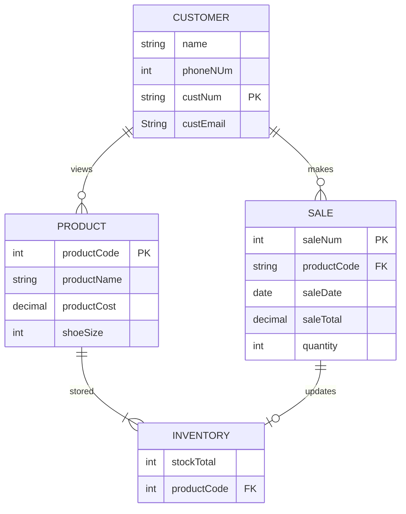

### Relationships
* Products: The different shoe models that are sold and tracked within Nike Store. Customer can purchase multiple in one sale.
* Customers: Indivdiual that browses and initiates sale of show products. There will be multiple customers that visit the store to make a sale.
* Sales: Transactions made by Customers. Has information pertaining to inventory bought
* Inventory: Tracks the amount of stock per shoe model/size. Updated when items are sold.

### Entities

**PRODUCT**: 
   - `productCode`: Unique identifier for each product
   - `productName`: Brand and model of shoe
   - `productCost`: Price of the product
   - `shoeSize`: Shoe size 

 **CUSTOMER**: 
   - `name`: Name of the customer.
   - `phoneNum`: Phone number
   - `custNum`: Unique identifier for customer
   - `email`: Email address

 **SALE**: 
   - `saleNum`: Transaction number, which is unique to each sale
   - `saleDate`: Date of the sale
   - `productCode`: Unique identifier for each product
   - `quantity`: Number of products purchased
   - `saleTotal`: Transaction Total

 **INVENTORY**: 
   - `productCode`: Foreign key linked to the PRODUCT.
   - `stockTotal`: Current stock level

  
